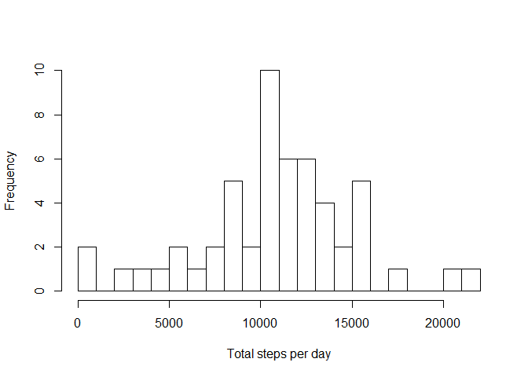
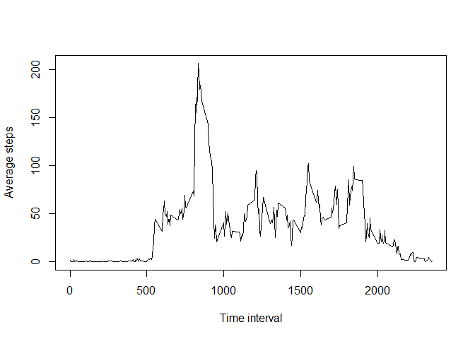
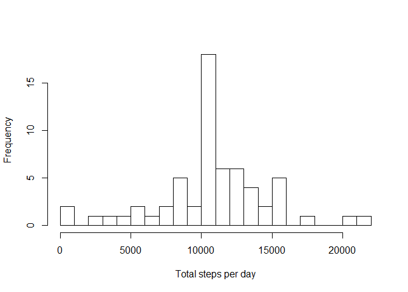
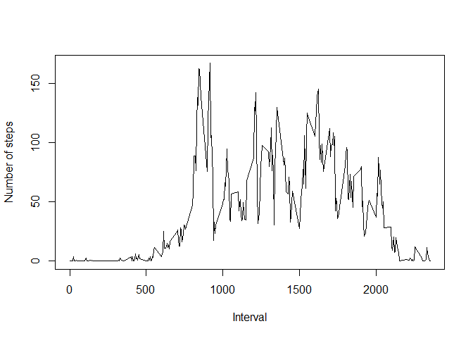
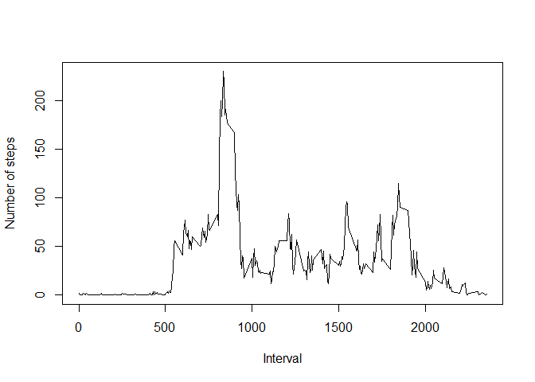
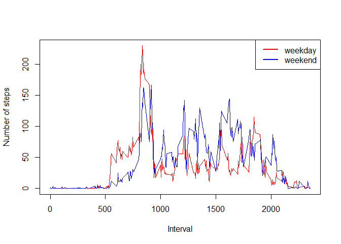

# Reproducible Research: Peer Assessment 1
Divydeep Agarwal  
15 July 2015  

## Loading and preprocessing the data
Loading the csv file from the working directory. Also including the dplyr package.

```r
library(dplyr)
```

```
## 
## Attaching package: 'dplyr'
## 
## The following object is masked from 'package:stats':
## 
##     filter
## 
## The following objects are masked from 'package:base':
## 
##     intersect, setdiff, setequal, union
```

```r
act <- read.csv("activity.csv")
```

## What is mean total number of steps taken per day?
To calculate total number of steps per day, we split the steps by date and then sum all of them. The resultant data is used to make histogram.

```r
a <- split(act$steps, act$date)
b <- as.numeric(lapply(a,sum))
hist(b,breaks = 20,main = "",xlab = "Total steps per day")
```

 


```r
mean(b,na.rm = TRUE)
```

```
## [1] 10766.19
```

```r
median(b,na.rm = TRUE)
```

```
## [1] 10765
```

The mean and median values are 10766.19 and 10765 respectively.

## What is the average daily activity pattern?
We have to factorize the intervals first. Then we split the steps based on interval and calculate the average number of steps taken, averaged across all days.

```r
act$interval <- as.factor(as.numeric(act$interval))
a <- split(act$steps, act$interval)
b <- as.numeric(lapply(a,mean, na.rm = T))
data1 <- data.frame(interval = as.numeric(levels(act$interval)),mean=b)
data2 <- data1[order(data1$mean,decreasing = TRUE),]
plot(data1$mean ~ data1$interval, type="l",ylab = "Average steps",xlab = "Time interval")
```

 


```r
max.data2 <- data2$interval[1]
max.data2
```

```
## [1] 835
```

The 5-minute interval, on average across all the days in the dataset, which contains the maximum number of steps is between 8:35 and 8:40.

## Imputing missing values

```r
sum(is.na(act$steps))
```

```
## [1] 2304
```

The total number of missing values in the dataset are 2304.  

The strategy used to fill the missing values in the dataset is to change the NAs to the mean for that 5-minute interval.  

```r
a <- split(act$steps, act$interval)
b <- as.numeric(lapply(a,mean, na.rm = T))
c <- data.frame(interval = as.numeric(levels(act$interval)), mean = b)
steps.full = vector()
for (i in seq_along(act$steps)){
  if(is.na(act$steps[i])){
    steps.full <- c(steps.full,c$mean[c$interval == act$interval[i]])
  }
  else{
    steps.full <- c(steps.full,act$steps[i])
  }
}
```
Creating a new data set with missing data filled in

```r
data.full <- data.frame(steps = steps.full, date = act$date, interval = act$interval)
```


```r
d <- split(data.full$steps,data.full$date)
e <- as.numeric(lapply(d,sum))
hist(e, breaks=20, xlab = "Total steps per day", main = "")
```

 


```r
mean(e, na.rm = T)
```

```
## [1] 10766.19
```


```r
median(e, na.rm = T)
```

```
## [1] 10766.19
```
The mean and median values are both 10766.19. The mean values has remain unchanged whereas the median value has augmented after imputing the missing data as compared to the first part of assignment. Imputing missing data has no major impact on the estimates of the total daily number of steps.

## Are there differences in activity patterns between weekdays and weekends?
The data is augmented by adding a new factor variable with 2 levels: "weekday" and "weekend"

```r
data.weekdays <- weekdays(as.POSIXct(act$date))
day.vector <- vector()
for(i in seq_along(data.weekdays)){
  if (data.weekdays[i] == "Saturday" || data.weekdays[i] == "Sunday"){
    day.vector <- c(day.vector,"Weekend")
  }
  else{
    day.vector <- c(day.vector,"Weekday")
  }
}
d1 <- data.full
d1$day.type <- day.vector
d1$day.type <- as.factor(d1$day.type)
```

Create Plot1 for weekend

```r
dat1 <- filter(d1,d1$day.type == "Weekend")
dat1a <- split(dat1$steps, dat1$interval)
dat1b <- as.numeric(lapply(dat1a,mean, na.rm = T))
dat1.data <- data.frame(interval = as.numeric(levels(dat1$interval)), mean = dat1b)
plot(dat1.data$mean ~ dat1.data$interval, type = "l",ylab = "Number of steps",xlab="Interval")
```

 

Create Plot2 for weekday

```r
dat2 <- filter(d1,d1$day.type == "Weekday")
dat2a <- split(dat2$steps, dat2$interval)
dat2b <- as.numeric(lapply(dat2a,mean, na.rm = T))
dat2.data <- data.frame(interval = as.numeric(levels(dat2$interval)), mean = dat2b)
plot(dat2.data$mean ~ dat2.data$interval, type = "l",ylab = "Number of steps",xlab="Interval")
```

 

To better compare the weekday and weekend activity patterns, we need to plot both weekend and weekday data on the same plot.

```r
dat2 <- filter(d1,d1$day.type == "Weekday")
dat2a <- split(dat2$steps, dat2$interval)
dat2b <- as.numeric(lapply(dat2a,mean, na.rm = T))
dat2.data <- data.frame(interval = as.numeric(levels(dat2$interval)), mean = dat2b)
plot(dat2.data$mean ~ dat2.data$interval, type = "l",ylab = "Number of steps",xlab="Interval", col="red")
lines(dat1.data$mean ~ dat1.data$interval, type= "l", col="blue")
legend("topright", col=c("red","blue"), legend = c("weekday","weekend"),lty = 1,lwd = 2)
```

 

We can see there is much more physical activity on weekends as compared to weekdays.
